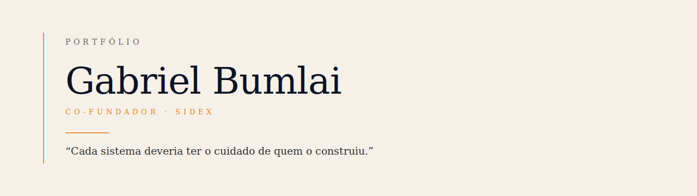

<picture>
  <source media="(prefers-color-scheme: dark)" srcset="assets/header-dark.svg">
  <source media="(prefers-color-scheme: light)" srcset="assets/header-light.svg">
  
</picture>

 

## Sobre

Co-fundador da **SIDEX** e responsável técnico por todo o ecossistema de software da holding.

Atuo como engenheiro full-stack, desenhando arquitetura, banco de dados, segurança e integração de IA em sistemas que vão do e-commerce ao planejamento financeiro pessoal — passando por gestão interna, mobile e dashboards corporativos.

A SIDEX entrega tecnologia em duas frentes: desenvolvimento sob demanda para empresas que querem construir sistemas próprios, e licenciamento de produtos prontos como o WINEX, o FinanceIA e os próximos que estão por vir.

 

  

 

## Projetos

### WINEX *— em produção*

Plataforma premium de e-commerce de vinhos importados de Argentina, Portugal, Chile, Itália, França e Brasil. Stack TypeScript ponta a ponta, com IA integrada como núcleo do produto em quatro frentes:

- **Insight Engine** — BI conversacional em português. Administrador pergunta em linguagem natural e recebe dashboards visuais como resposta.
- **Scanner mobile** — escaneia o rótulo, retorna a ficha completa do vinho. Quando está no catálogo, leva o usuário direto ao produto. Quando não está, alimenta a inteligência de compra do administrador.
- **Ficha técnica automática** — IA preenche perfil sensorial, harmonização e janela de guarda no cadastro de produto, reduzindo minutos de trabalho a segundos.
- **Sommelier** *— em desenvolvimento* — chatbot premium para assinantes do clube, com recomendação personalizada e harmonização ao vivo.

 

### FinanceIA *— em desenvolvimento*

Assessor financeiro pessoal com IA, disponível no site e no app mobile. Funciona como um consultor sempre acessível, capaz de:

- Registrar gastos e investimentos em conversa natural.
- Planejar metas de longo prazo: casa, carro, abertura de empresa, reserva.
- Projetar patrimônio em horizontes de 5, 10 e 20 anos com base na carteira atual.
- Sugerir ajustes inteligentes em tempo real e gerar gráficos preditivos interativos.

<!-- ERP Inteligente — em desenvolvimento futuro, descomentar quando começar -->

 

  

 

## Tecnologias

#### Linguagens e frameworks

#### Mobile

#### Dados e infraestrutura

#### Inteligência artificial

#### Ambiente de desenvolvimento

 

  

 

## Trabalhe com a SIDEX

Construímos a infraestrutura tecnológica do **WINEX**. Podemos construir a sua sob demanda — ou licenciar a que já existe.

